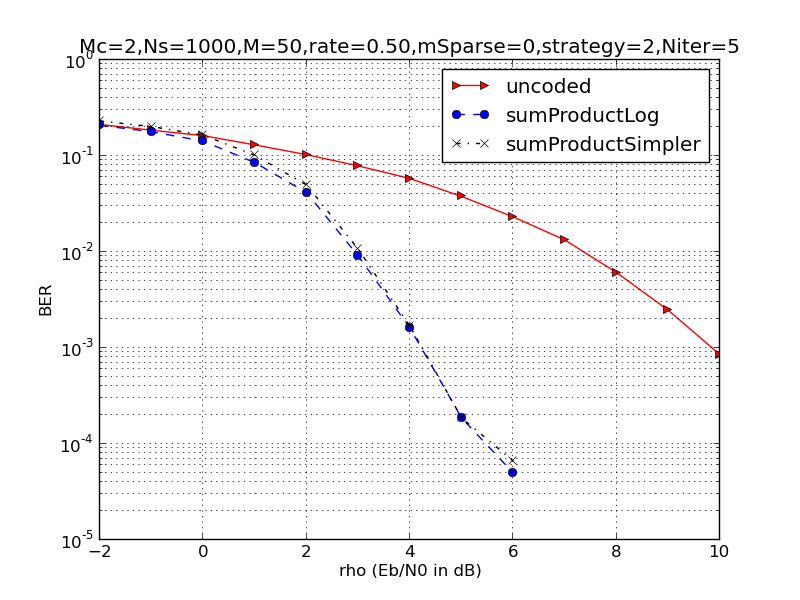
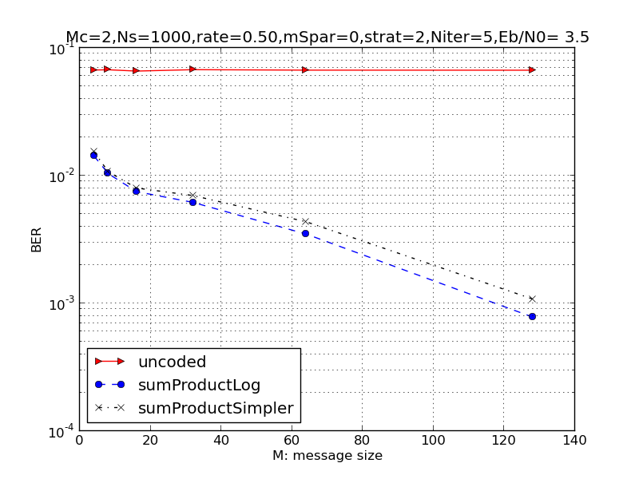

# LDPCsim

[](https://travis-ci.org/christianpeel/LDPCsim.jl)

<!---
[](http://pkg.julialang.org/?pkg=LDPCsim&ver=release)
-->

[Low-density parity-check](https://en.wikipedia.org/wiki/Low-density_parity-check_code)
(LDPC) codes are popular linear error-correction codes. Originally
invented by
[Robert Gallager](https://en.wikipedia.org/wiki/Robert_G._Gallager)
[1], they were rediscovered in 1996 by
[David MacKay](https://en.wikipedia.org/wiki/David_J.C._MacKay) and
Bradford Neal [2]. They are now widely used in digital
communications. This package gives an implementation in Julia of the
LDPC design technique in [3].

This was implemented as a learning excercise and refresher; though it
will hopefully become mature enough to be trusted and widely useful it
is not so at present. The "sim" in "LDPCsim" at present stands for
both "simple" and "simulate".

### Examples and Results

```julia
using PyPlot
Pkg.add("LDPCsim")
using LDPCsim

# Simulate 1000 frames with 50 samples of BPSK per frame. Show
# results from -4 to 8 dB Eb/N0. See the first figure below.
ldpcSim(1000,[-4.0:1:8],[50])

# Fix Eb/N0 at 3.5 dB, then vary the size of the frame from
# 4 to 128 to show that longer frames give better results.
# See the second figure below.
ldpcSim(1000,[3.5],[4,8,16,32,64,128])
```

 In this first figure, we
see that at high SNR, the LDPC-coded signals give a big advantage over
uncoded data. The simplified sum-product receiver does a
bit worse than the basic log-domain receiver in this scenario with a
50-bit rate 1/2 code; 1000 frames were simulated for each data point. 

 Next, we show how
increasing block length improves BER. In this figure, the SNR is held
fixed at 3.5 dB, and the size of the frame is varied from 4 to 128 in
powers of 2 to show that longer frames give better results. When
plotted against SNR, the longer-length codes have a sharper waterfall
region.


### References

[1] Robert G. Gallager (1963). "Low Density Parity Check
Codes". Monograph, M.I.T. Press.

[2]  David J.C. MacKay and Radford M. Neal, "Near Shannon Limit
Performance of Low Density Parity Check Codes," Electronics Letters,
July 1996.

[3] Radford M. Neal,
["Software for Low Density Parity Check (LDPC) codes"](http://www.cs.toronto.edu/~radford/ldpc.software.html)
(see also the [GitHub](https://github.com/radfordneal/LDPC-codes)
repo; and this [Matlab](https://sites.google.com/site/bsnugroho/ldpc)
implementation).

---

This module was written by
[Chris Peel](https://github.com/ChristianPeel).
